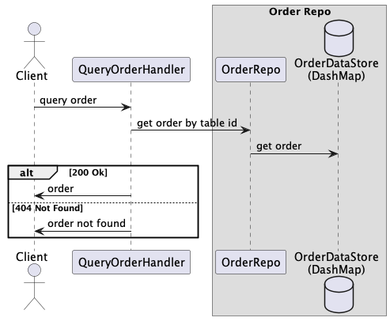

# Simple Restaurant API

### There are 6 APIs.

Please check [swagger file](./swagger.yaml) for the complete contract

| API                                       | Description                      |
|-------------------------------------------|----------------------------------|
| POST /orders                              | create new order                 |
| GET /orders/{table-id}                    | get order by table id            |
| DELETE /orders/{table-id}                 | delete order by table id         |
| POST /meal-items                          | add meal items to existing order |
| GET /meal-items/{table-id}/{meal-item-id} | get meal item                    |
| DELETE /meal-items                        | delete meal items                |

Use Postman would be easier for testing the APIs. Can find collections [here](./RAPI.postman_collection.json). 
<br> Or there are curl examples. Can find them [here](./curl_examples)

### How to start application
```
cargo run
cargo run -- 3
make run
make run ARGS="3"

#first parameter is size of chef thread pool; default is 2
```
### How to run unit tests
```
cargo test
make test
```

### General Testing Scenarios

Can run in any order.
However, to run happy case, There are some assumptions need to know.
#### Assumption
1. Order has four status: Received, Preparing, Completed, and Canceled
2. MealItem has three status: Receive, Preparing, and Completed. Plus is_removed flag.
3. We can only create order if there is no order in received or preparing status for the same table
4. We can only add meal items if there exists order for the table
5. We can only remove meal item if it's not being prepared or completed
6. We can only remove order if none of the meal item is being prepared or completed
7. We always do soft delete, meaning data is not really removed from data store

#### Steps
1. start application
2. run **Post /orders** to create order
    - menu_item_id: could be any uuid number
    - name: could be any
    - price: if price is 50.95, then use String 5095 here
3. run **POST /meal-items** to add more meal items to the created order
    - table_id: should be same as previous one; otherwise, get not found error
    - menu_item_id: could be any uuid number
    - name: could be any
    - price: if price is 50.95, then use String 5095 here
4. run **GET /orders/{table-id}**
    - table_id: should be same as previous one; otherwise, get not found error
5. run **GET /meal-items/{table-id}/{meal-item-id}**
    - table_id: should be same as previous one
    - meal_item_id: you can find all the meal-item-id from response of step 1, 2, or 3. Can pick any of them.
    - if providing invalid table_id or meal-item-id, will get not found error
6. run **DELETE /orders/{table-id}**
    - table_id:
        - given valid table_id and if order is being prepared or completed, will fail to delete order
        - using invalid table_id, will get not found error
7. run **DELETE /meal-items**
    - if there are any valid meal_item_ids, those meal items which are not yet being prepared will be deleted and others
      will be just omitted
    - if table_id and none of meal_item_ids are valid, will get error message

### Application Modules

1. main is the entry point of application
2. handlers have all the handlers handling 6 APIs respectively
3. libraries have thread_pool, job, and worker. These are used to create a chef thread pool, and we have a channel to
   queue the cooking job(we use meal item's cooking time as thread's sleeping time). The number of thread should be same
   as number of chef we want.
4. models have all the models to CRUD order, meal item, and menu item (though menu item is not really used)
5. repositories have all the repositories for order and menu. Though menu is not really used. All the data change can
   only be done via repositories. No data change can be done via data model. I use DashMap as data store here.

### Application Logic

We start the server on **127.0.0.1:3030** by **running cargo run** or **cargo run -- {pool_size}**. 
The server can handle each request asynchronously. I did not limit the number of threads here which can be improved.

When a POST request is received at **/order** or **/meal-items**, the thread places each meal item as a cooking job into a channel. 
Concurrently, a chef thread pool consumes these cooking jobs from the channel and prepares the meal items.

For example, if the thread pool has 2 threads, it means we have 2 chefs. 
When a client sends a request with 3 meal_items for table 1, these 3 items representing 3 jobs are sent to the channel (FIFO). 
If another request with 2 meal_items for table 2 is received, these items are also sent to the same channel.

The chef threads continuously consume meal items from the channel. 
Based on the cooking time of each meal item, the chef thread will sleep to simulate the cooking process.
The field names as _cooking_time_in_min_ but to see the result faster, the thread actually sleeps for the same amount of time but unit is second.
Before going to sleep, the chef thread update meal item's status as _Preparing_, preventing the client from canceling it. 
Once the thread wakes up, it updates meal item's status as _Completed_, preventing the client from canceling it.

Meal items in the channel with the default status received can still be canceled by the client. 
If a chef thread retrieves a meal item and finds it's removed from the order after checking the database, it will return without further processing.

The cooking_time_upper_bound_in_min in the order model represents the sum of the cooking times for non-removed and non-completed meal items. 
While multiple chef threads can process meals simultaneously, potentially reducing the actual cooking time, the upper bound indicates the _maximum_ required time.

### Application Improvement Areas

Due to time constraints, I have not yet finished everything but this version should cover basic functions.
There are still many improvements space. I will note down here.

1. Currently only critical components have unit tests added. 
2. Should separate out DB model from domain model, currently we use the same model for both for simplicity(though make testing more difficult)
3. Error handling can be more concise and unified
4. Separate request and response models from handler modules
5. Menu models are actually dummy models. Otherwise, we should validate received Menu with DB's Menu or have different
   implementation to avoid data manipulation, ex. price manipulation
6. Limit the number of threads serving API requests
7. Archive completed order to another table (another data structure). Now when order is completed or canceled, order can be overridden.
8. Once order gets started preparing, we can't cancel order as a whole. We can improve to have more granular control where maybe we can cancel those meals not yet being prepared.
9. API Path and method design did not follow best practice. Can be improved. There are some issues while defining Path as _/orders/{table-id}/meal-items/{meal-item-id}_, I am still looking into this. But what's in my mind are
   - POST /orders
   - GET /orders/{table-id}
   - DELETE /orders/{table-id}
   - POST /orders/meal-items
   - GET /orders/{table-id}/meal-items/{meal-item-id}
   - DELETE /orders/meal-items  (for deleting multiple items)
   - DELETE /orders/{table-id}/meal-items/{meal-item-id} (for deleting single item, not implemented, 
   can use previous one to achieve the same goal)
10. Currently, we can delete data multiple times, this can be improved.
11. I am still trying to refine the logic so to either borrow or move ownership of value rightly
12. Remove the duplicated code


### Class Diagram


### Sequence Diagrams
- add meal items sequence diagram

- add order sequence diagram

- worker in detail sequence diagram

- query meal item sequence diagram

- query order sequence diagram

- remove meal items sequence diagram

- remove order sequence diagram
